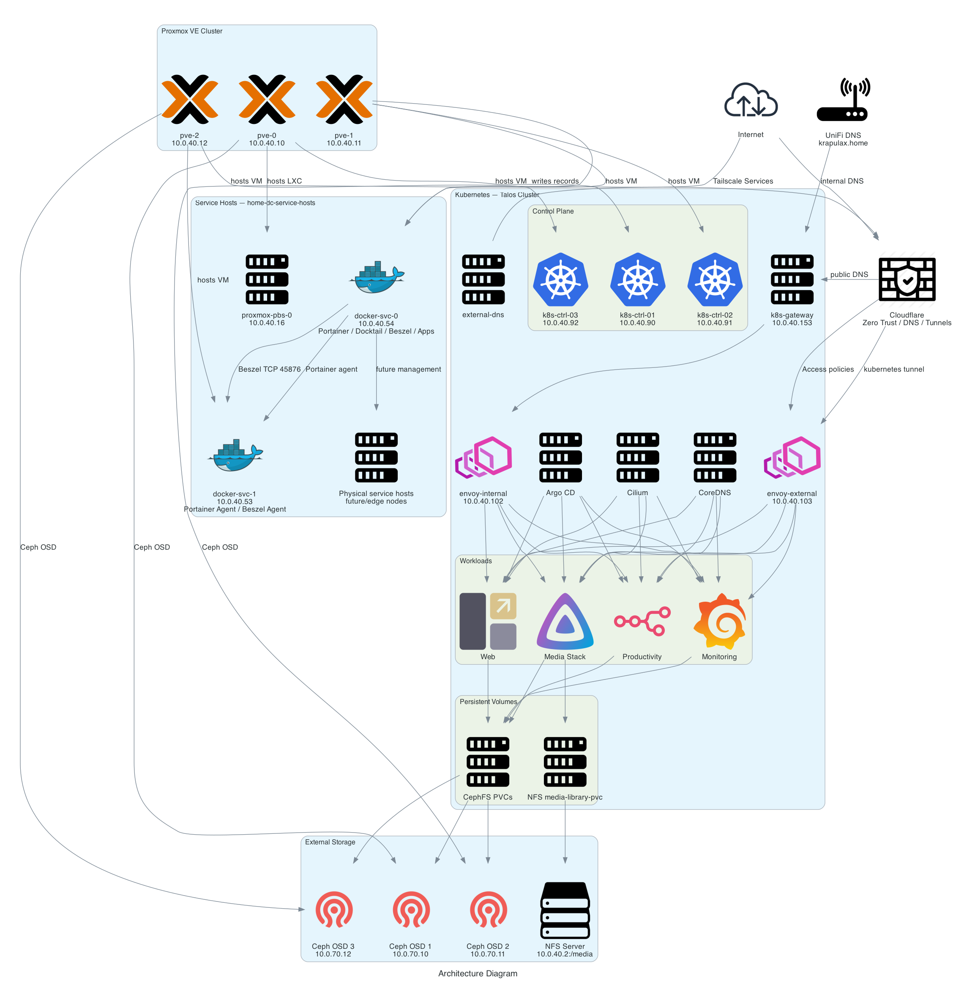

# Home DC Overview

High-level map of the homelab. Core repos:

| Repo | Remote | Role |
|------|--------|------|
| [`home-dc-proxmox`](../home-dc-proxmox) | [github.com/fabricesemti80/home-dc-proxmox](https://github.com/fabricesemti80/home-dc-proxmox) | Bare-metal Proxmox VE + Ceph cluster |
| [`home-dc-kubernetes`](../home-dc-kubernetes) | [github.com/fabricesemti80/home-dc-kubernetes](https://github.com/fabricesemti80/home-dc-kubernetes) | Talos Kubernetes cluster and GitOps workloads |
| [`home-dc-service-hosts`](../home-dc-service-hosts) | [github.com/fabricesemti80/home-dc-service-hosts](https://github.com/fabricesemti80/home-dc-service-hosts) | Standalone service hosts: Docker VMs, PBS LXC, physical hosts |
| [`home-dc-docker`](../home-dc-docker) | [github.com/fabricesemti80/home-dc-docker](https://github.com/fabricesemti80/home-dc-docker) | Legacy Docker host stack on `morpheus` |

<!-- ponytail: intentionally excludes secret values, token strings, and password hashes; see each repo's local/runtime files -->

---

## Architecture Diagram



<!-- ponytail: regenerate with `python assets/generate-diagram.py` after `pip install diagrams` and graphviz -->

---

## Network Layout

| Network | CIDR | Purpose |
|---------|------|---------|
| Management / VM | `10.0.40.0/24` | Proxmox UI, VMs, Kubernetes nodes, Docker host, NFS |
| Ceph storage | `10.0.70.0/24` | Ceph cluster traffic between Proxmox nodes |
| Kubernetes pods | `10.42.0.0/16` | Pod IPs (default) |
| Kubernetes services | `10.43.0.0/16` | Service IPs (default) |

### Key Addresses

| Host / Service | IP |
|----------------|-----|
| Proxmox nodes | `10.0.40.10` – `10.0.40.12` |
| Proxmox VIP (Keepalived) | `10.0.40.15` |
| NFS server | `10.0.40.2` |
| Proxmox Backup Server (`proxmox-pbs-0`) | `10.0.40.16` |
| Docker service host (`docker-svc-0`) | `10.0.40.54` |
| Docker service host (`docker-svc-1`) | `10.0.40.53` |
| Legacy Docker host (`morpheus`) | `10.0.40.19` |
| Kubernetes control-plane nodes | `10.0.40.90` – `10.0.40.92` |
| Kubernetes API VIP | `10.0.40.101` |
| Internal gateway (`envoy-internal`) | `10.0.40.102` |
| External gateway (`envoy-external`) | `10.0.40.103` |
| Kubernetes DNS gateway (`k8s-gateway`) | `10.0.40.153` |
| Management VM (`deep-thought-01`) | `10.0.40.100` *(disabled by default)* |

---

## Layer 1: Proxmox (`home-dc-proxmox`)

- **3-node Proxmox VE cluster** (`pve-0`, `pve-1`, `pve-2`) on Debian 12.
- **Keepalived** floating VIP at `10.0.40.15` for HA web UI access.
- **Ceph** distributed storage across the three nodes, using dedicated NVMe drives on the `10.0.70.0/24` storage network.
- **NFS integration** from `10.0.40.2` for backups, ISOs, templates, and the shared media library.
- **API tokens** for Packer (`packer@pve`) and Terraform (`terraform@pve`) automation.
- **Backup jobs**, Gmail SMTP notifications, Chrony NTP, SSH key deployment.

Managed with Ansible + `Taskfile.yml`.

---

## Layer 2: Kubernetes (`home-dc-kubernetes`)

### Cluster

- **Talos Linux** VMs running on Proxmox.
- Active nodes: 3 control-plane nodes only (`k8s-ctrl-01` – `k8s-ctrl-03`).
- Legacy worker VMs exist in Proxmox but are **powered off** and not in the active Talos inventory.
- API endpoint uses a Talos VIP at `10.0.40.101`.

### Networking

- **Cilium** CNI in kube-proxy-free mode.
- **CoreDNS** for in-cluster DNS.
- **Envoy Gateway** (`envoy-internal` / `envoy-external`) exposes HTTPRoutes.
- **k8s-gateway** at `10.0.40.153` provides split-horizon DNS for local clients.
- **Cloudflare Tunnel** (`cloudflared`) brings public traffic in without opening ports.
- **external-dns** publishes records to Cloudflare.

### GitOps

- **Argo CD** watches `fabricesemti80/home-dc-kubernetes` and reconciles apps under `kubernetes/apps/`.
- Bootstrap ordering in `bootstrap/helmfile.d/` installs Cilium, CoreDNS, Spegel, cert-manager, Argo CD, etc.

### Storage

- **CephFS** via `ceph-csi` for workload config PVCs (`storageClass: cephfs`).
- **NFS media library** at `10.0.40.2:/media` exposed as `media-library-pvc` for media apps.

### Workloads

| Namespace | Apps |
|-----------|------|
| `media` | jellyfin, jellyseerr, immich, prowlarr, qbittorrent, radarr, sonarr, sabnzbd, recyclarr, tdarr |
| `productivity` | linkwarden, n8n, termix |
| `monitoring` | kube-prometheus-stack (Prometheus + Grafana), beszel-agent |
| `network` | cloudflare-dns, cloudflare-tunnel, envoy-gateway, k8s-gateway |
| `web` | glance, homepage |
| `argo-system` | argo-cd |
| `kube-system` | cilium, coredns, etcd-defrag, metrics-server, reloader, spegel, ceph-csi |
| `ci-cd` | arc-controller, arc-runner-set-homelab |
| `default` | echo |
| `doppler-operator-system` | doppler-operator |

### Ingress / Domains

- Base domain: `krapulax.dev`
- Internal domain: `krapulax.home`
- Public apps terminate through Cloudflare Access / Zero Trust, except webhook paths and bypassed apps like Jellyfin.
- Local DNS records for media apps point to the internal gateway via UniFi.

### Secrets

- **Doppler** operator syncs secrets into Kubernetes.
- **SOPS + age** for encrypted Git-stored secrets.
- No secrets committed to Git.

---

## Layer 3: Service Hosts (`home-dc-service-hosts`)

Standalone VMs, LXCs, and physical hosts for services kept outside Kubernetes.
Docker stacks are Portainer-managed from GitOps compose files where appropriate.

### Services

| Service | Role |
|---------|------|
| Portainer | Docker management UI and GitOps stack deployment |
| Docktail | Tailscale Service proxy for Docker-host apps |
| Homepage | Internal service dashboard |
| Beszel | Host and container monitoring |
| Uptime Kuma | Uptime monitoring |
| Vaultwarden | Password manager |
| Technitium | DNS server |
| Whoami | Test / debug endpoint |
| Proxmox Backup Server | Backup target, currently LXC-backed |

### Network / Access

- Docker stacks share the `homelab_proxy` bridge network.
- Public service access uses native Tailscale Services via Docktail, e.g. `*.koala-dominant.ts.net`.
- Beszel agents on Docker hosts listen on TCP `45876`.

### Secrets

- Local `.env` values are ignored by Git; `.env.example` documents required variables.
- No secrets committed to Git.

---

## Terraform / OpenTofu Stacks

| Stack | Repo | Purpose |
|-------|------|---------|
| `infra/terraform_proxmox` | `home-dc-kubernetes` | Proxmox VMs for Talos and optional management VM |
| `infra/terraform_cloudflare` | `home-dc-kubernetes` | Kubernetes tunnel, DNS, Access apps/policies |
| `infra/terraform_localdns` | `home-dc-kubernetes` | UniFi local DNS records for `*.krapulax.home` |
| `terraform/` | `home-dc-service-hosts` | Standalone service VMs/LXCs and Tailscale services |

---

## Common Entrypoints

### Proxmox repo

```bash
task plan      # dry-run Ansible
task apply     # deploy cluster config
```

### Kubernetes repo

```bash
mise install && task deps
task tf:plan
task talos:genconfig
task talos:bootstrap
task apps:bootstrap
task verify:cluster
```

### Service-hosts repo

```bash
task tf:plan
task tf:apply
task ansible:apply
```

---

## Notes / Simplifications

- The Kubernetes cluster runs control-plane-only for current workloads; workers are retained as rollback capacity.
- Legacy `home-dc-docker` still exists for `morpheus`; active service-host work is in `home-dc-service-hosts`.
- Management VM `deep-thought-01` is defined but disabled by default.
